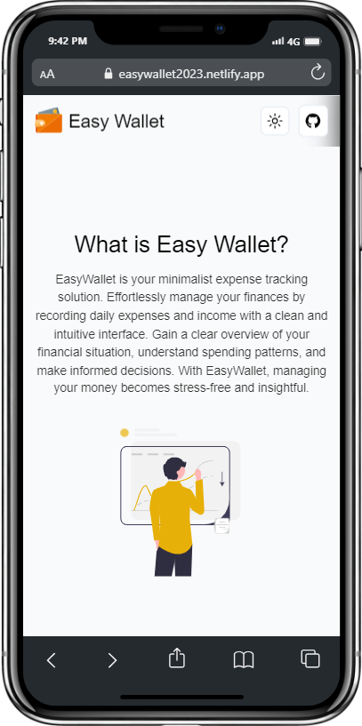
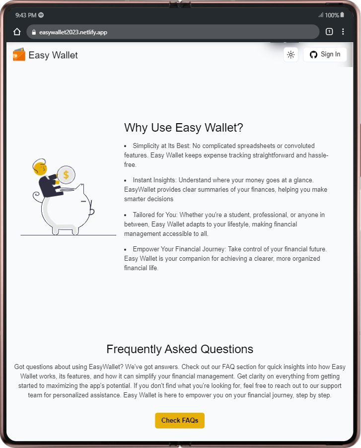
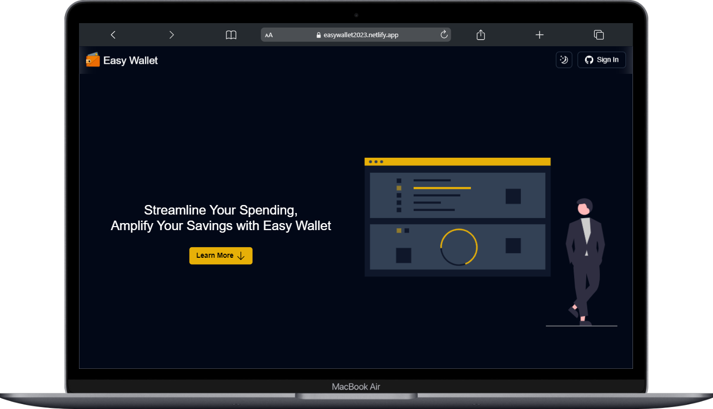

[![Contributors][contributors-shield]][contributors-url]
[![Forks][forks-shield]][forks-url]
[![Stargazers][stars-shield]][stars-url]
[![Issues][issues-shield]][issues-url]
[![MIT License][license-shield]][license-url]

<style>
 .imgs {
 display: flex;
 flex-direction: row;
 justify-content: space-between;
 align-items: center;
 margin: 0 auto;
 width: 100%;
 max-width: 765px;
 gap: 10px;
 margin-bottom: 60px;
 margin-top: 60px;
 }

 /*media query*/
 @media (max-width: 765px) {
  .imgs {
   flex-direction: column;
  gap: 30px;
  }
   }
</style>

<!-- PROJECT LOGO -->
<br />
<div align="center">
  

  <h3 align="center">Easy Wallet - API</h3>

  <p align="center">
    This is the back end of the Easy Wallet project, a web application that helps you to manage your finances.
  <br />
    <strong>Status: <u>Development</u>

  </strong>
    <br />
    <a href="#"><strong>Explore the docs »</strong></a>
    <br />
    <a href="https://easywallet2023.netlify.app/">View Demo</a>
    ·
    <a href="https://github.com/TiagoRibeiro25/Easy-Wallet-BE/issues">Report Bug</a>
    ·
    <a href="https://github.com/TiagoRibeiro25/Easy-Wallet-BE/issues">Request Feature</a>
  </p>
</div>

<div class="imgs">
 
 
 
</div>

<!-- ABOUT THE PROJECT -->
## About The Project

Easy Wallet is a web application that allows users to manage their finances. It was made with the purpose of helping people to organize their money and to have a better understanding of their expenses and incomes.

This project was made as a side project with the purpose of getting familiar with the technologies used in the development of the application.

### Built With

* [Golang](https://golang.org/)
* [Echo](https://echo.labstack.com/)
* [GORM](https://gorm.io/)
* [PostgreSQL](https://www.postgresql.org/)
* [Docker](https://www.docker.com/)

<!-- GETTING STARTED -->
## Getting Started

To get a local copy up and running follow these simple steps.

### Prerequisites

In order to run this project, you need to have installed

* Golang*
* Nodejs and npm (in case you want to use [nodemon](https://www.npmjs.com/package/nodemon))
* Docker and docker-compose (in case you want to use the provided docker-compose file to run the PostgreSQL database)

You also need to have access to the a:

* PostgreSQL database (or use the provided docker-compose file)
* Redis database (or use the provided docker-compose file)
* Cloudinary account
* Mailjet account

### Installation

1. Clone the repo

   ```sh
   git clone https://github.com/TiagoRibeiro25/Easy-Wallet-BE.git
   ```

2. Install NPM packages (in case you want to use nodemon)

   ```sh
   npm install
   ```

3. Create a .env file, add the variables in the .env.example file and fill them with your own values.

4. Have a PostgreSQL database and Redis database running (or use the provided docker-compose file)

5. Run the project

* Using nodemon

   ```sh
   npm run dev
   ```

* Using go run

   ```sh
   go run ./src
   ```

<!-- CONTRIBUTING -->
## Contributing

Contributions are what make the open source community such an amazing place to learn, inspire, and create. Any contributions you make are **greatly appreciated**.

If you have a suggestion that would make this better, please fork the repo and create a pull request. You can also simply open an issue with the tag "enhancement".

1. Fork the Project
2. Create your Feature Branch (`git checkout -b feature/AmazingFeature`)
3. Commit your Changes (`git commit -m 'Add some AmazingFeature'`)
4. Push to the Branch (`git push origin feature/AmazingFeature`)
5. Open a Pull Request

<!-- LICENSE -->
## License

Distributed under the MIT License. See `LICENSE.txt` for more information.

<!-- CONTACT -->
## Contact

Contact through my [personal website](https://tiagoribeiro.tech/contact).

<!-- MARKDOWN LINKS & IMAGES -->
[contributors-shield]: https://img.shields.io/github/contributors/TiagoRibeiro25/Easy-Wallet-BE.svg?style=for-the-badge
[contributors-url]: https://github.com/TiagoRibeiro25/Easy-Wallet-BE/graphs/contributors
[forks-shield]: https://img.shields.io/github/forks/TiagoRibeiro25/Easy-Wallet-BE.svg?style=for-the-badge
[forks-url]: https://github.com/TiagoRibeiro25/Easy-Wallet-BE/network/members
[stars-shield]: https://img.shields.io/github/stars/TiagoRibeiro25/Easy-Wallet-BE.svg?style=for-the-badge
[stars-url]: https://github.com/TiagoRibeiro25/Easy-Wallet-BE/stargazers
[issues-shield]: https://img.shields.io/github/issues/TiagoRibeiro25/Easy-Wallet-BE.svg?style=for-the-badge
[issues-url]: https://github.com/TiagoRibeiro25/Easy-Wallet-BE/issues
[license-shield]: https://img.shields.io/github/license/TiagoRibeiro25/Easy-Wallet-BE.svg?style=for-the-badge
[license-url]: https://github.com/TiagoRibeiro25/Easy-Wallet-BE/blob/master/LICENSE.txt
